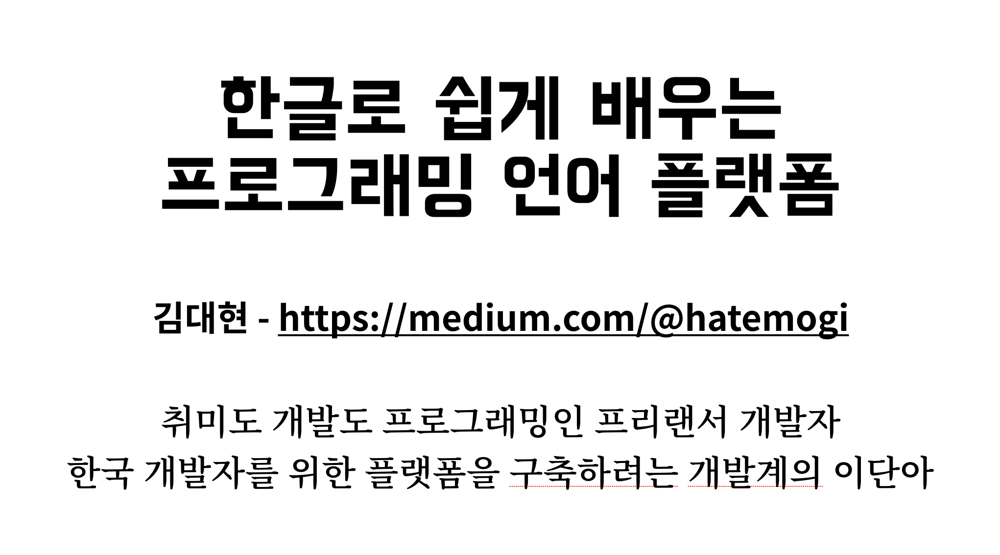
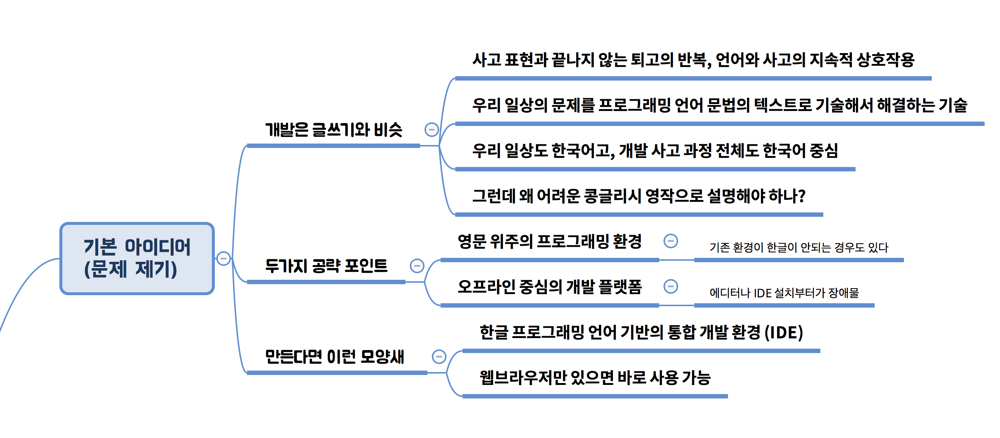
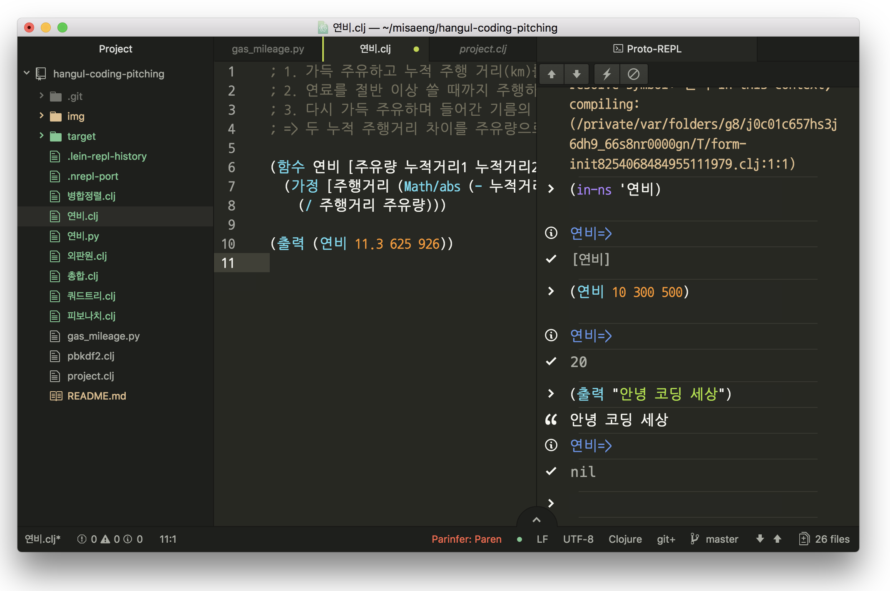
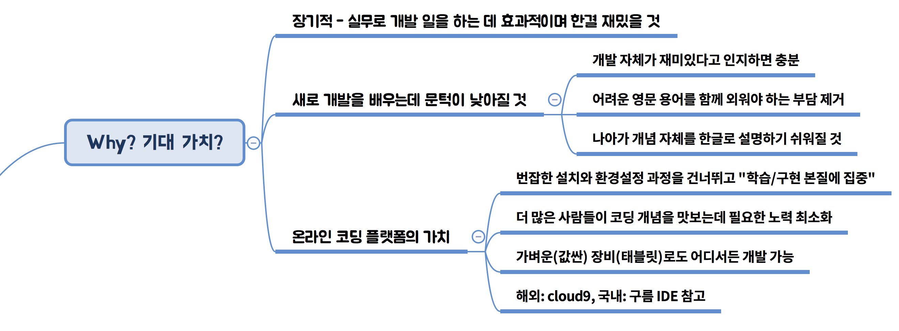
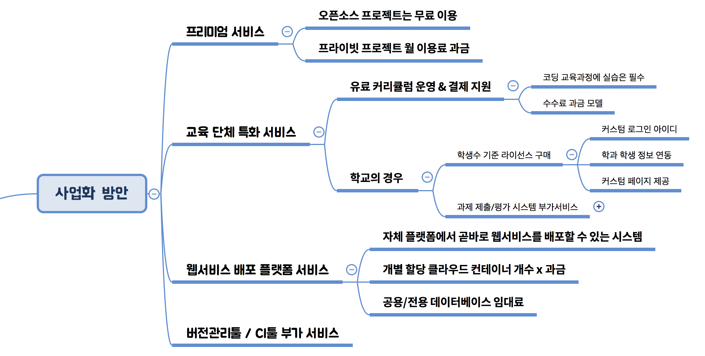
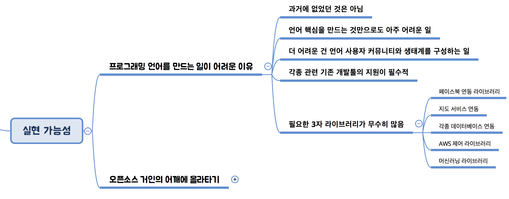
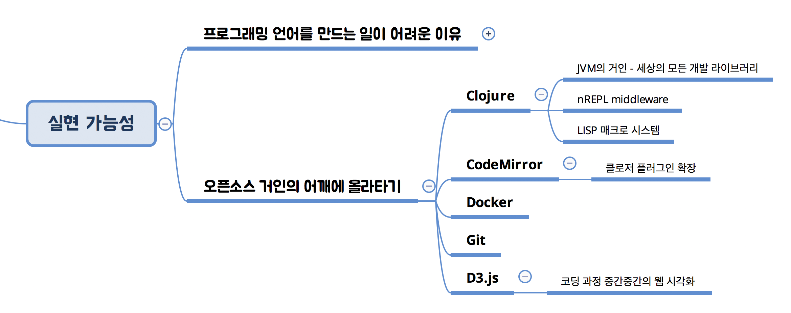
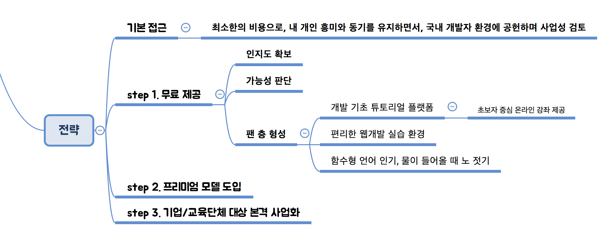
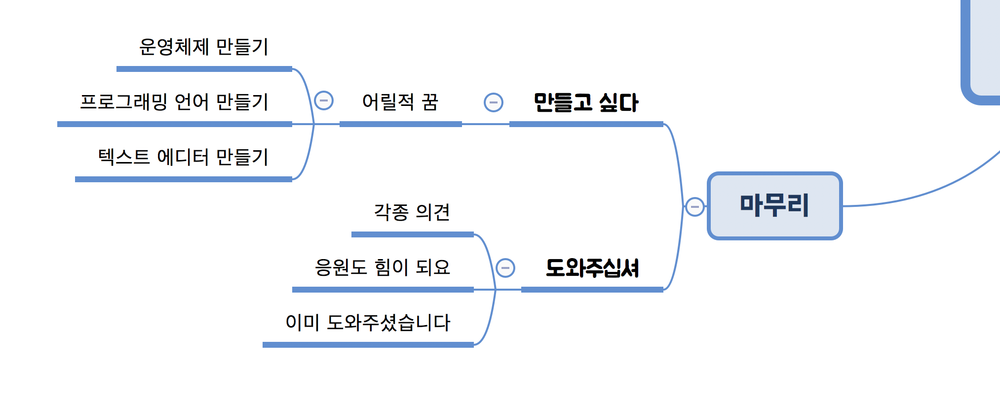

리허설#1: 9분

# 한글로 쉽게 배우는 프로그래밍 언어 플랫폼

안녕하세요, 프리랜서 개발자 김대현입니다. 개발자들이 소프트웨어를 만드는 과정에 쓰는 *프로그래밍 언어*를 한글로 만들어서 쉽게 코딩하자는 아이디어를 발표하겠습니다.

누구나 스마트폰 갖고 다니시면서 유용한 앱을 깔아서 쓰시고, 노트북으로도 페이스북이나 구글 같은 웹서비스 많이 쓰시는데요, 그런 앱이나 웹 서비스를 만들 때, 개발자들이 열심히 머릿속으로 논리적으로 생각한 내용을 자바, 파이썬, 스위프트 같은 프로그래밍 언어로 소스 코드를  작성해 만들거든요. 그런데 지금은 이 소스 코드라는 것을 영문으로만 작성하고, 머리 속 생각을 영작하듯 쓰고 있습니다.

예를 들어서, 우리가 자동차를 새로 샀고 좀 원시적인 방법으로 연비를 직접 계산해 보려는 상황을 설정해 볼게요. 그걸 파이썬이라는 프로그래밍 언어로 코딩해 본 화면입니다. 파이썬이라는 프로그래밍 언어는 배우기 쉬우면서도 강력해서 아주 널리 쓰이는 프로그래밍 언어입니다.

그런데 말입니다. 안 그래도 파이썬이라는 프로그래밍 언어가 생소한데, 저 영어 단어들까지 소화하려니 더 어려운 것 같습니다. 사실 파이썬을 쓸 때도 한글로 코딩할 수 있습니다.

한글로 쓰면, 적어도 제 생각에는, 영문보다 더 읽기 쉽고  작성하기도 쉽다고 생각합니다. 다만, 불행히도, 대다수 기존 프로그래머들은 이런 시도를 꺼리는 이유가 있는데, 그중 하나는 "한글과 영문을 섞어 쓰니 오히려 이상하다"는 점도 있었습니다. 그래서, 여기서 좀 너무 나간 게 아닌가 걱정입니다만, 아예 "한글로 프로그래밍 언어까지 만들면 어떨까?"하는 생각이 들었습니다.

최근 학생 뿐 아니라 일반 성인도 새로 코딩을 배우려는 사람이 많은데, 그분들께 걸림돌 중 하나가 어려운 영어로 이해하고 작성해야 하는 점도 있지 않나 합니다. 한글 프로그래밍 언어를 만들어서 쓸 수 있다면, 처음 프로그래밍을 배우려는 사람들에게, 한결 편리하지 않을까 하는 생각도 듭니다. 이 화면이 앞서 보인 파이썬 코드와 같은 일을 하는 걸, 나름의 한글 프로그래밍 언어로 재작성한  코드입니다.

개발 과정에 있어 코딩은 우리 평소 글쓰기와 꽤 비슷합니다. 머릿속 생각을 텍스트로 표현하고, 고쳐가며 계속 개선합니다. 프로그래밍 언어와 사고도 일상 언어처럼 서로 영향을 주고 받습니다. 그리고 개발이라는 게 결국 "우리 주변의 문제를 프로그래밍 언어로 기술해서 해결하겠다"는 건데 우리 일상은 한국어 중심이고, 생각도 한국어로 한단 말이죠. 그런데도 굳이 코딩할 때는 애써 콩글리시 영작을 해가며 개발한다는 게 이상하다는 생각이 들어요.

새로운 프로그래밍 언어, 게다가 한글 언어라는 점이 생소해서 당장 널리 쓰이기는 어려울 텐데요, 쉽게 접근해 부담 없이 써보기 좋게끔, 웹브라우저에서 곧바로 쓸 수 있게 하면 좋겠습니다. 한글 프로그래밍 환경을 내 컴퓨터에 설치하고 준비하는 과정 자체를 없애는 거죠.

이 아이디어로 기대하는 점은, 장기적으로는 직업 개발자들이 실무 개발 일을 하는 데 더 효과적이 되길 기대하고, 새로 배우는 분에게는 개발의 문턱을 낮추는 효과입니다.

그리고, 이를 웹브라우저에서 바로 쓰는 온라인 플랫폼으로 만들면, 개발 환경을 설치하는 번잡한 사전 작업을 건너뛰고, 학습과 구현 자체 본질에 집중하기 좋겠고요. 그러면 더 많은 분들이 코딩 개념을 맛보는데 필요한 노력이 최소화될 거예요. 마치 우리가 기존에 아래아한글이나 워드로 내 컴퓨터에 파일로 저장해서 문서를 작성하는 것이, 구글 닥스나 오피스 365처럼 온라인 중심으로 넘어가는 상황과 비슷하게 말이죠.

여기까지 기본 아이디어로, 그럼 이제 "이걸로 어떻게 돈을 벌 거냐?"가 궁금해지는데요, 우선 프리미엄(freemium) 모델 과금으로 수익을 낼 수 있습니다. 오픈 소스 프로젝트는 무료로 마음껏 쓰게 하고, 비공개 프로젝트를 진행하려면 월 이용료를 받습니다. 그리고, 교육단체나 기업에 특화한 유료 서비스를 제공합니다. 개발 교육 과정에 아무래도 코딩 실습과 과제는 필수일 텐데요, 그 과정을 온라인 개발 플랫폼에서 쉽게 다루게 하고, 이용료를 교육 단체나 기업으로부터 받는 거죠. 학생들은 무료로 쓰고요. 그 외에도 몇가지 유료 부가서비스를 제공할 수 있을 것 같습니다.

다음, "이걸 어떻게 만들 것인가" 말씀드려보겠습니다. 우선, 프로그래밍 언어를 만들겠다는 일이 말처럼 쉬운 일은 아닙니다. 과거에 한글로 프로그래밍 언어를 만든 시도가 더러 있습니다만, 이내 잊히고 말았습니다.

프로그래밍 언어를 만드는 일은 언어의 문법을 정의하고 최소한의 기본 컴파일러를 만드는 것만으로도 매우 어려운 일인 데다, 그 언어를 사용하는 충분한 사용자 커뮤니티를 확보하고, 각종 빌드 툴과 에디터 플러그인을 비롯한 환경을 구축하는데 매우 많은 노력이 필요합니다. 쓸모 있는 앱을 만들려면 써드파티 라이브러리가 많이 필요한데, 일일이 직접 만들기는 힘듭니다.

그래서 현실적인 접근 방법으로, 이미 잘 갖춰진 오픈소스 거인들의 어깨에 사뿐히 올라타는 방법이 있습니다. 이미 잘 갖춰진 자바라는 프로그래밍 언어 생태계를 그대로 써서 새로운 언어를 만드는 경우가 많습니다. 스칼라, 그리고 최근 안드로이드 개발 표준으로 선택된 코틀린이 그런 방식입니다. 클로저라는 함수형 프로그래밍 언어도 자바라는 거인의 어깨에 올라타서 신생 언어의 어려운 문제들을 쉽게 해결했는데요, 저는 이 클로저의 어깨위에 한글 언어를 올렸습니다. 초대형 거인 자바에 올라탄 작은 거인 클로저 위에, 살짝 한글로 올라탄 꼬맹이가 되는 겁니다. 한글 프로그래밍 언어 코드 자체는 사소해 보이지만, 그 아래 클로저나, 또 그 아래 자바라는 거인은 무시할 수 없습니다.

그 외에도, 웹브라우저용 코딩 에디터를 만들고, 서버사이드에 돌릴 리소스를 확보하는 것도, 이미 나와있는 훌륭한 오픈 소스 제품을 활용해서, 직접 만들어야 할 부분을 최소화합니다. 창작이라기보다 이미 잘 나와있는 것들을 입맛에 맞게 잘 조합하는 코디네이터가 되는 거죠.

기본 접근 방향은 "최소한의 비용으로, 제 개인 흥미와 동기를 최적으로 유지하면서, 국내 개발자 환경에 공헌하며 사업성을 검토"하는 것입니다. 첫 번째로 우선 무료 서비스 단계에서는 사용자 층을 충분히 확보하는 걸 목표로 하고, 두 번째 단계로, 비공개 프로젝트에 대한 프리미엄 유료 서비스 모델을 추가합니다. 프리미엄 모델까지 간다면 우선 서버 운영비 등을 충당하고 남을 수익이 발생할 테고요, 그 단계까지 성공한다면, 세 번째 단계로 기업이나 교육 단체를 대상으로 본격적인 사업을 벌이면 될 것 같습니다.

이상, 한글 코딩이라는 주제로부터 출발한 언어와 플랫폼 아이디어를 말씀드렸습니다. 아마 사업적 가치의 여부와 큰 상관없이, 제 나름 꼬물꼬물 계속할 프로젝트지만, 여러분들의 도움이 있다면 더욱 재미있을 것 같습니다. 각종 의견이나 질문, 응원, 비판 환영하겠습니다. 귀한 시간 내어 경청해 주셔서 감사합니다.

- 끝 -
