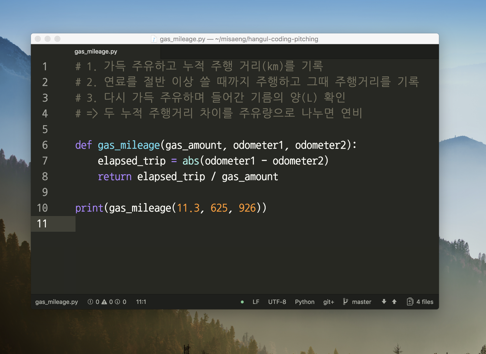
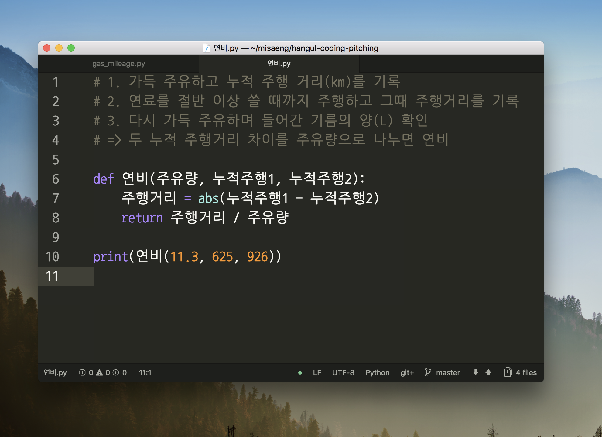
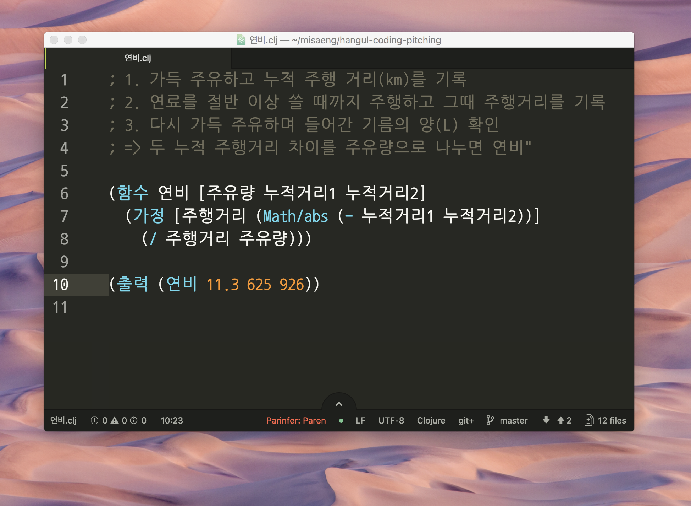

# 한글 프로그래밍 언어와 온라인 코딩 플랫폼

안녕하세요, 귀한 시간 내주셔서 감사합니다. 저는 애월에 사는 프리랜서 개발자 김대현입니다. 오늘 발표할 아이디어는, 개발자들이 소프트웨어를 만드는 과정에 쓰는 _프로그래밍 언어_와 _플랫폼_을 한글로 만들어서 사업화하겠다는 내용입니다.

[소개 슬라이드]

여러분 누구나 스마트폰 갖고 다니시면서 유용한 앱들도 깔아서 쓰시고, 노트북 앞에 앉아있을 때는 페이스북이나 구글 같이 유용한 웹서비스 많이 쓰시잖아요? 그런 앱이나 웹 서비스를 개발할 때, 개발자들이 열심히 논리적으로 생각해서 자바, 파이썬, 스위프트 같은 프로그래밍 언어로 소스 코드를  작성해 낸 결과가 우리가 쓸 수 있는 소프트웨어가 되는 겁니다. 그런데 지금은 이 소스 코드라는 것을 영문으로만 작성하고, 머리 속 생각을 그때그때 영작하듯 바꿔서 표기하고 있습니다.

예를 들어 우리가 차를 새로 샀다고 상황을 설정해 볼게요. 신나는 일이죠. 보통 차량 스펙에 이미 공인 연비가 공개되고 계기반에도 연비가 표시되는 경우가 있지만, 내가 실제로 주행하는 패턴에 따른 실제 연비를 확인하고 싶을 때도 있잖아요? (저만 그런가요?) 그럴때 실제 연비를 직접 파이썬 프로그래밍 언어로 코딩해서 한번 계산해 본 모습입니다. 파이썬은 쉬우면서도 강력해서, 최근 각광 받는 머신러닝 분야에서도 널리 쓰이는 프로그래밍 언어라 들어보신 분 많으실 거에요.

그런데 말입니다. 안 그래도 파이썬이라는 언어가 생소한데, 저 영어 단어들까지 이해하려니 더 어렵지 않나요? 사실은 파이썬으로도 한글로 코딩할 수 있습니다.

단지 이렇게 써도 된다는 사실을 몰라서 안쓰는 분들도 많습니다만, 암튼 얼마나 동의하실지는 모르겠지만, 적어도 제 생각에는 영문보다 더 이해하기 쉽고,  작성할 때도 더 쉽다고 생각합니다. 다만, 불행히도, 대다수 기성 프로그래머들은 이런 시도에 거부감을 보이는 이유가 있는데, 그 중 하나는 "한글과 영문을 섞어 쓰니 오히려 이상하다"는 점도 있었습니다. 그래서 말입니다, 여기서 좀 너무 나간 게 아닌가 걱정이 됩니다만, 아예 프로그래밍 언어까지 만들면 한글로 코딩하기 자연스럽겠다는 생각이 이어졌습니다.

최근 학생들 뿐 아니라 일반 성인들도 새로 코딩을 배우려는 사람이 많은데, 그분들께 걸림돌 중 하나가 어려운 영어로 이해하고 작성해야 하는 점이 아닐까 합니다. 만약 한글 프로그래밍 언어를 만들어서 아주 쉽게 접근해서 쓸 수 있게 한다면, 기성 프로그래머들은 어떨지 몰라도, 새로 프로그래밍을 배우려는 사람들에게, 그리고 교육하는 사람 입장에서도 한결 편리하지 않을까 하는 기대로 이어졌습니다. 이 화면이 앞서 보인 파이썬 코드와 같은 일을 하는 걸, 제가 만든 한글 프로그래밍 언어로 작성한  코드입니다.

[슬라이드 1]

짤막한 코드만 보여드려 놓고 말씀드리기 좀 성급합니다만, 개발 과정에 있어 코딩은 우리 평소 글쓰기와 꽤 비슷합니다. 머리속 생각을 표현하고, 고쳐가며 끊임 없이 개선합니다. 그리고 프로그래밍 할 때에도 일상의 한국어나 영어와  마찬가지로 표현하는 언어와 생각하는 사고가 서로 영향을 주고 받습니다. 그리고 개발이라는 게 결국 우리 일상의 문제를 프로그래밍 언어 문법의 텍스트로 기술해서 해결하겠다는 것입니다. 그런데 우리 일상은 한국어 투성이고, 개발 사고 과정 전체도 한국어 중심입니다. 그런데도 굳이 코딩할 때만 애써 콩글리시 영작을 해가며 개발한다는 게 불편한 상황인 거죠.

그래서 저는, 두가지 상황을 조금 바꿔서 우리 한국 사람들이 더 쉽게 개발할 수 있게 하고자 합니다. 먼저 이미 말씀드린, 영문 위주의 프로그래밍 환경을, 한글로 더 쓸 수 있는 프로그래밍 언어를 제공해서 흔들어 봅니다. 그리고, 기존 오프라인 중심의 개발 환경을 온라인에서 제공하면서 한글 프로그래밍 환경을 준비하는 부담을 획기적으로 줄이는 거죠.

[목표 이미지]

이 아이디어의 결과물로 기대한는 점은, 장기적으로는 직업 개발자들이 실무 개발 일을 하는 데 더 효과적이 되길 기대하고, 새로 배우는 사람들에게는 개발의 문턱을 낮추는 효과가 있을 겁니다. 그리고, 이를 온라인 코딩 플랫폼으로 제공한다면, 기존 개발 환경을 설치하는 번잡한 사전 작업을 건너뛰고, 학습과 구현 자체 본질에 집중하기 좋아질 것입니다. 그러면 더 많은 일반인이 코딩 개념을 맛보는데 필요한 노력이 최소화 되겠지요. 온라인 플랫폼이라는 건, 마치 우리가 기존에 아래아한글이나 워드로 내 컴퓨터에서 문서를 작성하던 시절이, 구글닥스나 오피스365처럼 온라인 중심으로 넘어가고 있다는 점을 생각하시면 와닿으실 것 같습니다.

여기까지가 기본 아이디어이고, 그럼 이제 이걸로 어떻게 돈을 벌 거냐가 중요해지는데요, 아직 산만한 아이디어들이지만, 이런 가능성들을 생각해볼 수 있겠습니다. 우선 프리미엄 모델 과금으로 수익을 낼 수 있습니다. 오픈소스 프로젝트는 마음껏 개발할 수 있는 환경을 무료로 제공하고, 비공개 프로젝트를 진행하려면 월 이용료를 받습니다. 그리고, 교육용 플랫폼으로 생각해본다면, 교육단체에 특화한 유료 서비스를 제공할 수도 있습니다. 개발 교육 과정에 실습과 과제는 필수일 텐데요, 그 과정을 온라인 개발 플랫폼에서 유연하게 제공해주고, 이용료를 교육 단체에게 받는 거죠. 학생들은 무료로 쓰고요. 학교나 교육기관이 학생 수를 기준으로 라이선스를 구매하는 모델입니다.
